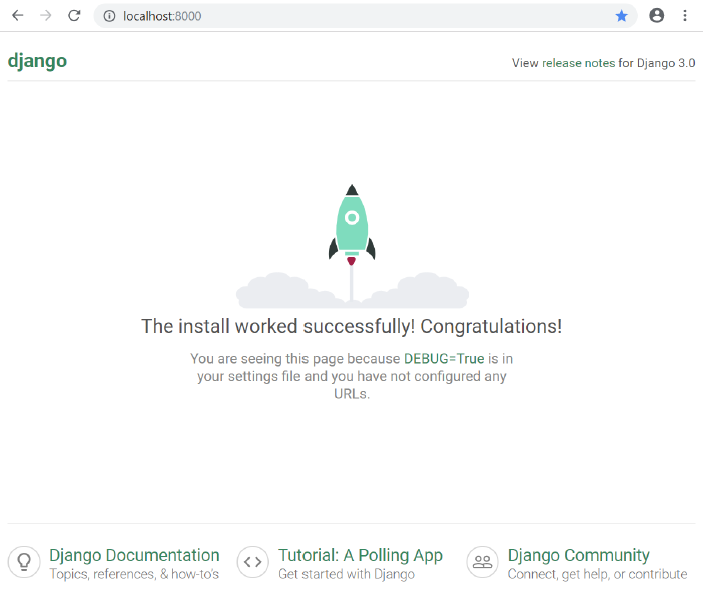

# Django without pain
## База
pip install django

Создаём папку проекта, заходим в родительскую. Выполняем:
```ps
django-admin startproject <name>
```

Должно получиться так:
```
<name>
    <name>
        asgi.py
        settings.py
        urls.py
        wsgi.py
    manage.py
```
Переходим в папку проекта и выполняем:
```ps
py manage.py runserver
```
Переходим по ссылке из терминала -- должно быть что-то типа:
  

Далее создаём своё приложение:
```ps
py manage.py startapp <app>
```
Теперь иерархия такая:
```
<name>
    manage.py
    <name>
        asgi.py
        settings.py
        urls.py
        wsgi.py
    <app>
        admin.py
        apps.py
        models.py
        tests.py
        views.py
```

В `settings.py` допишем:
```py
INSTALLED_APPS = [
    ...
    '<app>.apps.<App>Config',
]
```

## Контроллеры
Контроллеры прописаны во `views.py`. Чтобы связать контроллер с маршрутом, надо прописать в `urls.py`:
```py
from <app>.views import <view>

urlpatterns = [
    path('path/', <view>),
]
```

Файлы нельзя передавать в GET запросах! Используем POST в отдельном файле:
```py
import requests

img = []
with open('../homer.png', 'rb') as f:
    img = f.read()
print(len(img))
response = requests.post('http://127.0.0.1:8000/image/', files={'image':img})
# при приёма на стороне сервера нужно ещё раз вызвать метод read() для получения байтов
print(response.status_code)
```
На стороне сервера необходимо отключить проверку безопасности декоратором `csrf_exempt`:
```py
from django.views.decorators.csrf import csrf_exempt
from django.http import HttpResponse, JsonResponse

@csrf_exempt 
def img_index(request):
    images = request.FILES.dict()
    print(images.keys())
    if 'image' not in images.keys():
        return HttpResponse('error', status=400)
    img = images['image']
    
    with open('homer__.png', 'wb') as f:
        f.write(img.read())    
    
    return HttpResponse('dsgds')
```


## Templates
По умолчанию, шаблоны лежат где-то в недрах пакета django. Чтобы это изменить, нужно добавить в `settings.py` в переменную `TEMPLATES[0]['DIRS']` необходимые папки. Например:
```py
'DIRS': [BASE_DIR],
```
Стили... Было больно, но я понял, что нужно настроить: пишите это
```py
STATIC_ROOT = f'{BASE_DIR}/base_static'
STATIC_URL = '/static/'
STATICFILES_DIRS = [
    f'{BASE_DIR}/static',
]
```
Наши стили теперь надо хранить в `BASE_DIR/static`. Затем нужно сказать джанге, чтоб он их "собрал":
```ps
py .\manage.py collectstatic
```
Если всё получилось, то при запущенном сервере должно быть возможным обратить к вашему css-файлу из адресной строки
```
http://127.0.0.1:8000/static/detector/css/base.css
```

В самом шаблоне использовать статики так (обязательно прописать `load static`):
```html
<!DOCTYPE html>
<html>
 <head>
  <meta charset="utf-8">
  <link rel="stylesheet" href="">
 </head>
 <body>
  <div style="font-size: 2em">
   <span>{{ message }}</span>
  </div>
 </body>
</html>
```